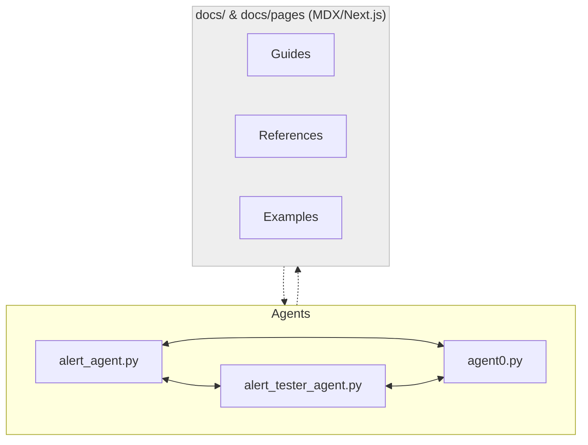

# System Architecture

This repository is structured to support rapid development, documentation, and experimentation with agent-based systems using Fetch.ai technologies.

## Components

- **agents/**: Contains Python source code for autonomous agents (e.g., `alert_agent`, `alert_tester_agent`). Each agent is implemented using the uAgents framework and is designed to be modular and extensible.
- **docs/**: Top-level directory for documentation, including quickstart guides and project overviews.
- **docs/pages/**: Houses the MDX/Next.js-style documentation site, with guides, references, and examples for both users and developers.
- **No backend services yet**: All agent logic runs locally or in the provided scripts; there is currently no persistent backend or database.

## Data Flow

- Agents communicate with each other via uAgents protocols, exchanging messages and performing tasks autonomously.
- The documentation site (MDX/Next.js) provides onboarding, guides, and references, but does not directly interact with agents (yet).
- Future extensions may introduce backend services or APIs for persistent storage, analytics, or integration.

## System Overview Diagram

## Extensibility

- The architecture is modular, allowing new agents or documentation sections to be added with minimal friction.
- Future plans include integrating backend APIs and expanding the documentation site to support interactive demos and agent monitoring.