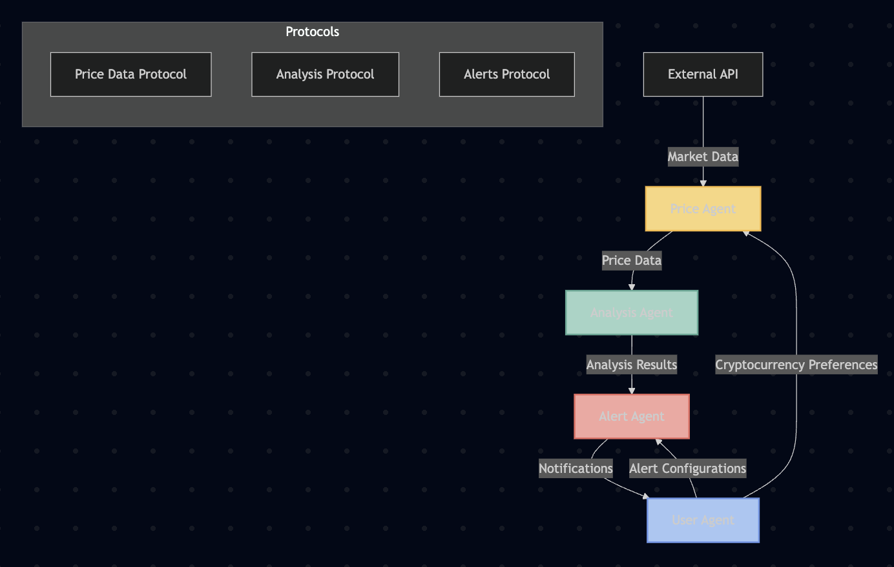

# DeFi Price Monitoring and Alert System

A comprehensive multi-agent system for monitoring cryptocurrency prices, performing technical analysis, and sending alerts based on user-defined conditions.



## Table of Contents

- [Overview](#overview)
- [Key Features](#key-features)
- [System Architecture](#system-architecture)
  - [Agent Communication Flow](#agent-communication-flow)
  - [Message Protocols](#message-protocols)
- [Installation](#installation)
  - [Prerequisites](#prerequisites)
  - [Setup](#setup)
  - [Configuration](#configuration)
- [Usage](#usage)
  - [Running the System](#running-the-system)
  - [Command Line Options](#command-line-options)
  - [Output Modes](#output-modes)
- [Configuring Alerts](#configuring-alerts)
  - [Default Alerts](#default-alerts)
  - [Creating Custom Alerts](#creating-custom-alerts)
  - [Alert Types](#alert-types)
- [Adding New Cryptocurrencies](#adding-new-cryptocurrencies)
- [Technical Analysis](#technical-analysis)
  - [Available Indicators](#available-indicators)
  - [Trend Detection](#trend-detection)
  - [Trading Signals](#trading-signals)
- [Storage and Persistence](#storage-and-persistence)
- [Troubleshooting](#troubleshooting)
- [Project Structure](#project-structure)
- [Technical Details](#technical-details)
  - [Price Agent](#price-agent)
  - [Analysis Agent](#analysis-agent)
  - [Alert Agent](#alert-agent)
  - [User Agent](#user-agent)
- [Extension Ideas](#extension-ideas)
- [API Usage](#api-usage)
- [Performance Considerations](#performance-considerations)
- [License](#license)
- [Acknowledgments](#acknowledgments)

## Overview

This project demonstrates the capabilities of the Agentverse platform by implementing a practical DeFi tool that helps users monitor cryptocurrency prices and receive alerts based on various conditions. The system consists of multiple autonomous agents that work together to fetch data, analyze it, and notify users when specific conditions are met.

The system is designed to be:
- **Modular**: Each agent has a specific responsibility
- **Extensible**: Easy to add new cryptocurrencies, indicators, or alert types
- **Reliable**: Agents communicate asynchronously and handle failures gracefully
- **Informative**: Provides detailed logs and notifications

### Key Features

- **Real-time Price Monitoring**: Fetch cryptocurrency prices from CoinGecko API
- **Technical Analysis**: Calculate indicators like RSI, MACD, and moving averages
- **Customizable Alerts**: Configure alerts based on price thresholds or technical indicators
- **Multi-Agent Architecture**: Demonstrates how multiple agents can work together
- **Persistent Storage**: Store historical data and user preferences
- **Extensible Design**: Easy to add new cryptocurrencies, indicators, or alert types
- **Debug Mode**: Detailed logging for troubleshooting
- **Selective Agent Execution**: Run specific agents as needed

## System Architecture

The system consists of four main agents, each with a specific responsibility:

1. **Price Agent**: Fetches cryptocurrency prices from the CoinGecko API at regular intervals, stores historical data, and responds to price requests from other agents.

2. **Analysis Agent**: Subscribes to price updates, performs technical analysis on the data, calculates various indicators, and generates trading signals.

3. **Alert Agent**: Monitors analysis results, checks if any user-defined alert conditions are met, and sends notifications when alerts are triggered.

4. **User Agent**: Represents the end user, manages preferences, receives notifications, and provides an interface for configuring alerts.

### Agent Communication Flow

The agents communicate with each other in the following sequence:

1. The **Price Agent** fetches cryptocurrency prices from CoinGecko at regular intervals.
2. The **Analysis Agent** receives price updates from the Price Agent and performs technical analysis.
3. The **Alert Agent** receives analysis results from the Analysis Agent and checks for triggered alerts.
4. The **User Agent** receives notifications from the Alert Agent when alerts are triggered.

Additionally:
- The **User Agent** can request price data directly from the Price Agent.
- The **User Agent** can request analysis results directly from the Analysis Agent.
- The **User Agent** can configure alerts through the Alert Agent.

### Message Protocols

Agents communicate with each other using well-defined message protocols:

- **Price Data Protocol**: For exchanging cryptocurrency price information
  - `PriceRequest`: Request price data for specific cryptocurrencies
  - `PriceResponse`: Response containing price data
  - `PriceUpdate`: Notification of price changes

- **Analysis Protocol**: For requesting and receiving technical analysis results
  - `AnalysisRequest`: Request analysis for a specific cryptocurrency
  - `AnalysisResponse`: Response containing analysis results
  - `AnalysisUpdate`: Notification of new analysis results

- **Alert Protocol**: For configuring alerts and receiving notifications
  - `ConfigureAlertRequest`: Request to create or update an alert
  - `DeleteAlertRequest`: Request to delete an alert
  - `ListAlertsRequest`: Request to list configured alerts
  - `AlertNotification`: Notification when an alert is triggered

## Installation

### Prerequisites

- Python 3.8 or higher
- pip (Python package manager)
- Internet connection (for API access)

### Setup

1. Clone the repository:
   ```bash
   git clone <repository-url>
   cd sample-project-1-price-monitor-alerts
   ```

2. Create and activate a virtual environment:
   ```bash
   python -m venv venv
   source venv/bin/activate  # On Windows: venv\Scripts\activate
   ```

3. Install dependencies:
   ```bash
   pip install -r requirements.txt
   ```

4. Create a `.env` file from the template:
   ```bash
   cp .env.template .env
   ```

### Configuration

Edit the `.env` file to customize your settings:

```
# Default cryptocurrencies to monitor
DEFAULT_CRYPTOCURRENCIES=BTC,ETH,SOL,AVAX,DOT

# Agent configuration (optional - will use defaults if not provided)
PRICE_AGENT_SEED=your_price_agent_seed_here
ANALYSIS_AGENT_SEED=your_analysis_agent_seed_here
ALERT_AGENT_SEED=your_alert_agent_seed_here
USER_AGENT_SEED=your_user_agent_seed_here

# Agent ports (optional - will use defaults if not provided)
PRICE_AGENT_PORT=8001
ANALYSIS_AGENT_PORT=8002
ALERT_AGENT_PORT=8003
USER_AGENT_PORT=8004

# Update interval in seconds (default: 300 seconds / 5 minutes)
PRICE_UPDATE_INTERVAL=300
```

**Important Configuration Notes:**

1. **Cryptocurrency List**: The `DEFAULT_CRYPTOCURRENCIES` setting defines which cryptocurrencies the system will monitor. You can add or remove cryptocurrencies from this list as needed.

2. **Agent Seeds**: The seed values are used to generate deterministic agent addresses. If you don't provide custom seeds, the system will use default values, but your agent addresses will change if you reinstall the system.

3. **Update Interval**: The `PRICE_UPDATE_INTERVAL` setting determines how often the Price Agent fetches new data from the API. Setting this too low might result in API rate limiting.

## Usage

### Running the System

To start all agents:

```bash
python run.py
```

To run specific agents:

```bash
python run.py --agents price analysis
```

To enable debug mode with more verbose output:

```bash
python run.py --debug
```

### Command Line Options

The `run.py` script supports the following command line options:

- `--agents`: Specify which agents to run. Valid values are `price`, `analysis`, `alert`, `user`, and `all` (default).
- `--debug`: Enable debug mode with more verbose output.

Examples:

```bash
# Run only the price and analysis agents
python run.py --agents price analysis

# Run all agents in debug mode
python run.py --debug

# Run only the alert agent in debug mode
python run.py --agents alert --debug
```

### Output Modes

The system has two output modes:

1. **Regular Mode**: Shows only important information like:
   - Agent addresses
   - Price updates
   - Alert triggers
   - Notifications

2. **Debug Mode**: Shows all information, including:
   - All agent logs
   - API requests and responses
   - Internal processing details
   - Registration messages
   - Connection attempts

## Configuring Alerts

### Default Alerts

The system comes with a few default alerts that are created when the Alert Agent starts for the first time:

1. BTC price above $80,000
2. ETH price below $1,600
3. SOL price above $100

### Creating Custom Alerts

Alerts can be configured programmatically through the User Agent. Here are some examples:

#### Price Alert

```python
# Create a price alert for Bitcoin
alert_config = AlertConfig.create(
    symbol="BTC",
    alert_type=AlertType.PRICE_ABOVE,
    threshold=50000.0,
    description="Bitcoin price above $50,000"
)

await configure_alert(ctx, alert_config)
```

#### RSI Alert

```python
# Create an RSI alert for Ethereum
alert_config = AlertConfig.create(
    symbol="ETH",
    alert_type=AlertType.RSI_OVERBOUGHT,
    threshold=70.0,
    description="Ethereum RSI overbought"
)

await configure_alert(ctx, alert_config)
```

### Alert Types

The system supports various types of alerts:

- **Price Alerts**:
  - `PRICE_ABOVE`: Triggered when price rises above a threshold
  - `PRICE_BELOW`: Triggered when price falls below a threshold
  - `PERCENT_CHANGE`: Triggered when price changes by a percentage

- **Technical Indicator Alerts**:
  - `RSI_OVERBOUGHT`: Triggered when RSI rises above a threshold
  - `RSI_OVERSOLD`: Triggered when RSI falls below a threshold
  - `MACD_CROSSOVER`: Triggered when MACD crosses above signal line
  - `MACD_CROSSUNDER`: Triggered when MACD crosses below signal line
  - `TREND_REVERSAL`: Triggered when price trend changes direction

## Adding New Cryptocurrencies

To add new cryptocurrencies to the system:

1. **Update the .env file**: Add the cryptocurrency symbol to the `DEFAULT_CRYPTOCURRENCIES` list:
   ```
   DEFAULT_CRYPTOCURRENCIES=BTC,ETH,SOL,AVAX,DOT,ADA,FET
   ```

2. **Add CoinGecko ID mapping**: If the cryptocurrency symbol doesn't match its CoinGecko ID, you need to add a mapping in the `price_agent.py` file:
   ```python
   symbol_to_id = {
       "BTC": "bitcoin",
       "ETH": "ethereum",
       "SOL": "solana",
       "AVAX": "avalanche-2",
       "DOT": "polkadot",
       "ADA": "cardano",
       "FET": "fetch-ai",
       "NEW_SYMBOL": "coingecko-id"  # Add your new cryptocurrency here
   }
   ```

3. **Clear agent storage**: If the agents have already run, you need to delete the agent storage files to pick up the new configuration. These agent storage files are the JSON files that have been created automatically in the sample project directory (agent<agent address>.json)

4. **Restart the system**: Run the system again to start monitoring the new cryptocurrencies:
   ```bash
   python run.py
   ```

## Technical Analysis

The Analysis Agent performs various technical analyses on the price data to generate insights and trading signals.

### Available Indicators

The system calculates the following technical indicators:

- **Relative Strength Index (RSI)**: Measures the speed and change of price movements
- **Moving Average Convergence Divergence (MACD)**: Shows the relationship between two moving averages
- **Simple Moving Average (SMA)**: Average price over a specific time period
- **Exponential Moving Average (EMA)**: Weighted average that gives more importance to recent prices

### Trend Detection

The system detects price trends based on moving averages and price patterns:

- **UP**: Price is trending upward
- **DOWN**: Price is trending downward
- **SIDEWAYS**: Price is moving sideways (no clear trend)

### Trading Signals

Based on the technical indicators and trend detection, the system generates trading signals:

- **BUY**: Indicates a potential buying opportunity
- **SELL**: Indicates a potential selling opportunity
- **HOLD**: Indicates that no action is recommended

Each signal also has a strength indicator:
- **STRONG**: High confidence in the signal
- **MODERATE**: Medium confidence in the signal
- **WEAK**: Low confidence in the signal

## Storage and Persistence

The system uses persistent storage to maintain state across restarts:

- **Historical Price Data**: The Price Agent stores historical price data for each cryptocurrency
- **Analysis Results**: The Analysis Agent stores the results of technical analysis
- **Alert Configurations**: The Alert Agent stores user-defined alert configurations
- **User Preferences**: The User Agent stores user preferences

The storage is implemented using JSON files in the project directory, with filenames based on the agent addresses.

To clear the storage and reset the system to its initial state, simply delete the agent data files:

```bash
# Delete all agent data files in the project directory
rm agent1*.json
```

## Troubleshooting

### Common Issues

1. **API Rate Limiting**: If you see errors like "Too many requests" or "Rate limit exceeded", try increasing the `PRICE_UPDATE_INTERVAL` in the `.env` file.

2. **Missing Cryptocurrency Data**: If you're not seeing data for a specific cryptocurrency:
   - Check if it's included in the `DEFAULT_CRYPTOCURRENCIES` list in the `.env` file
   - Check if it has a correct mapping in the `symbol_to_id` dictionary in `price_agent.py`
   - Verify that the cryptocurrency is available on CoinGecko

3. **Agents Not Starting**: If some agents fail to start:
   - Check the logs for error messages
   - Make sure all required dependencies are installed
   - Verify that the specified ports are available
   - Try running with the `--debug` flag for more detailed logs

4. **No Alerts Being Triggered**: If you're not seeing any alerts:
   - Check if any alert conditions are configured
   - Verify that the alert thresholds are reasonable
   - Check if the Alert Agent is running
   - Try creating a test alert with a threshold that should be immediately triggered

### Debugging Tips

1. **Use Debug Mode**: Run the system with the `--debug` flag to see more detailed logs:
   ```bash
   python run.py --debug
   ```

2. **Check Agent Addresses**: Make sure the agent addresses in the logs match the ones in your `.env` file.

3. **Inspect Agent Storage**: Look at the JSON files in the project directory to see what data is being stored.

4. **Run Agents Individually**: Run specific agents to isolate issues:
   ```bash
   python run.py --agents price
   ```

5. **Clear Agent Storage**: Reset the system to its initial state by deleting the agent data files:
   ```bash
   rm agent1*.json
   ```

## Project Structure

```
sample-project-1-price-monitor-alerts/
├── README.md                       # Project documentation
├── .env.template                   # Template for environment variables
├── .env                            # Environment variables (create from template)
├── requirements.txt                # Project dependencies
├── run.py                          # Script to run all agents
├── diagrams/                       # Architecture diagrams
│   └── system_architecture.png     # Visual representation of the system
├── protocols/                      # Shared message protocols
│   ├── __init__.py
│   ├── price_data.py               # Price data message models
│   ├── analysis.py                 # Analysis result message models
│   └── alerts.py                   # Alert configuration message models
└── agents/
    ├── __init__.py
    ├── price_agent.py              # Fetches cryptocurrency prices
    ├── analysis_agent.py           # Analyzes price movements
    ├── alert_agent.py              # Sends notifications
    └── user_agent.py               # Manages user preferences
```

## Technical Details

### Price Agent

The Price Agent is responsible for fetching cryptocurrency prices from the CoinGecko API and making them available to other agents.

**Key Responsibilities:**
- Fetch cryptocurrency prices at regular intervals
- Store historical price data
- Respond to price requests from other agents
- Broadcast price updates to subscribed agents

**Implementation Details:**
- Uses the free CoinGecko API to fetch price data
- Maps cryptocurrency symbols to CoinGecko IDs
- Stores historical data in a JSON file
- Implements rate limiting to avoid API restrictions
- Handles API errors gracefully

### Analysis Agent

The Analysis Agent performs technical analysis on price data to generate insights and trading signals.

**Key Responsibilities:**
- Subscribe to price updates from the Price Agent
- Calculate technical indicators (RSI, MACD, etc.)
- Detect price trends
- Generate trading signals
- Provide analysis results to other agents

**Implementation Details:**
- Uses the `talib` library for technical indicators
- Implements custom trend detection algorithms
- Generates trading signals based on multiple indicators
- Stores analysis results in a JSON file
- Provides both real-time and historical analysis

### Alert Agent

The Alert Agent monitors analysis results and triggers alerts based on user-defined conditions.

**Key Responsibilities:**
- Maintain a list of alert configurations
- Subscribe to analysis results from the Analysis Agent
- Check if any alert conditions are met
- Send notifications when alerts are triggered
- Provide an interface for configuring alerts

**Implementation Details:**
- Supports multiple alert types (price, indicator, trend)
- Implements a flexible alert configuration system
- Stores alert configurations in a JSON file
- Provides methods for creating, updating, and deleting alerts
- Handles notification delivery with retry logic

### User Agent

The User Agent represents the end user and provides an interface for interacting with the system.

**Key Responsibilities:**
- Manage user preferences
- Request price data and analysis results
- Configure alerts
- Receive notifications
- Display information to the user

**Implementation Details:**
- Stores user preferences in a JSON file
- Provides methods for requesting data from other agents
- Implements a notification system for receiving alerts
- Logs information to the console
- Periodically checks the status of the system

## Extension Ideas

Here are some ways to extend this project:

1. **Additional Data Sources**: Integrate with more APIs or blockchain data sources
2. **Advanced Analysis**: Implement more sophisticated technical analysis or ML-based predictions
3. **Trading Integration**: Connect with exchange APIs to execute trades based on alerts
4. **Cross-Chain Monitoring**: Extend to monitor assets across multiple blockchains
5. **DeFi Protocol Integration**: Monitor liquidity pools, yield farms, or lending protocols
6. **Web Interface**: Create a web dashboard to visualize data and manage alerts
7. **Notification Channels**: Add support for email, SMS, or messaging platforms
8. **Backtesting**: Add functionality to test strategies on historical data
9. **Portfolio Tracking**: Track the value of a cryptocurrency portfolio
10. **Social Sentiment Analysis**: Incorporate social media sentiment into the analysis

## API Usage

The system uses the CoinGecko API to fetch cryptocurrency price data. The free tier of the API has the following limitations:

- **Rate Limit**: 10-50 calls per minute (depending on server load)
- **Data Freshness**: Data may be delayed by a few minutes
- **Available Cryptocurrencies**: Most major cryptocurrencies are supported

The Price Agent is designed to work within these limitations by:
- Caching price data to reduce API calls
- Using a configurable update interval
- Implementing rate limiting
- Handling API errors gracefully

## Performance Considerations

The system is designed to be lightweight and efficient, but there are some performance considerations to keep in mind:

- **Memory Usage**: The system stores historical data in memory, which can grow over time. The Price Agent limits this by keeping only the last 100 data points for each cryptocurrency.

- **CPU Usage**: The technical analysis calculations can be CPU-intensive, especially for large datasets. The Analysis Agent optimizes this by calculating indicators incrementally as new data arrives.

- **Network Usage**: The system makes regular API calls to fetch price data. You can reduce network usage by increasing the `PRICE_UPDATE_INTERVAL` in the `.env` file.

- **Disk Usage**: The system stores data in JSON files, which can grow over time. You can clear the storage by deleting the agent data files (`rm agent1*.json`).